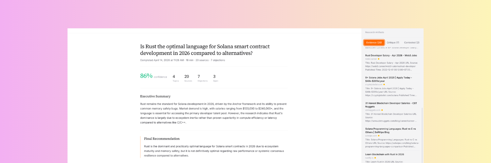

# Synapse

Synapse is a personal research agent built with **ElizaOS**.
It helps turn open-ended questions into structured, evidence-backed research sessions.

## Project Description

Synapse came out of a simple frustration: too much useful information was getting scattered across tabs, search tools, notes, and half-finished docs. I wanted one place where I could ask a question, let an agent do the digging, and get back something I could actually use.

Instead of dumping links or giving a vague summary, Synapse turns a research question into a structured workflow. It breaks the problem into topics, gathers evidence, challenges weak claims, and then produces a clean decision memo with sources, objections, contested points, and a confidence signal. The goal is not just to answer a question, but to leave behind something reusable.

I built it for the kind of questions that keep coming up in real work: product decisions, market research, technical tradeoffs, and personal planning. It is especially useful when you want a concise output you can revisit later, share with someone else, or move into another tool as part of a weekly review or planning process.

The backend runs on Nosana and the agent itself is powered by ElizaOS.

## Project Structure

```text
.
├── src/                  # agent source
├── client/               # optional frontend
├── nos_job_def/          # job definitions
├── scripts/              # utility scripts
├── Dockerfile
├── .env.example
└── README.md
```

## What this repo contains

- ElizaOS agent runtime
- custom research workflow plugin
- optional client app in `./client`
- Dockerfile for containerized runs

## Prerequisites

- Node.js 23+
- Bun
- Docker

## Getting Started

### 1. Clone and install

```bash
git clone https://github.com/hassnian/agent-challenge
cd agent-challenge
cp .env.example .env
bun install
```

### 2. Configure `.env`

Minimum required envs:

```env
OPENAI_API_KEY=your_key
OPENAI_BASE_URL=https://your-endpoint/v1
OPENAI_SMALL_MODEL=your-model-name
OPENAI_LARGE_MODEL=your-model-name
OPENAI_EMBEDDING_URL=https://your-embedding-endpoint/v1
OPENAI_EMBEDDING_API_KEY=your_embedding_key
OPENAI_EMBEDDING_MODEL=your-embedding-model
OPENAI_EMBEDDING_DIMENSIONS=1024
SERVER_PORT=3000
```

Search envs (at least one search provider is required):

```env
TAVILY_API_KEY=your_tavily_key
SERPER_API_KEY=your_serper_key
JINA_API_KEY=your_jina_key
```

Notes:
- use an **OpenAI-compatible** endpoint
- `OPENAI_BASE_URL` should usually end in `/v1`
- set `OPENAI_SMALL_MODEL` and `OPENAI_LARGE_MODEL` to the model name exposed by your provider
- at least one of `TAVILY_API_KEY` or `SERPER_API_KEY` is required for web research
- `JINA_API_KEY` is optional, but helps with reading source pages via `r.jina.ai`

### 3. Run locally

```bash
bun run dev
```

Open:

```text
http://localhost:3000
```

## Run with Docker

Local build:

```bash
docker build -t hassnian/nosana-eliza-agent:latest .
```

Run:

```bash
docker run --rm -it -p 3000:3000 --env-file .env hassnian/nosana-eliza-agent:latest
```

## Nosana Deployment

Nosana runners require a `linux/amd64` image.

```bash
npm run docker:build:nosana
npm run docker:push:nosana
```

Two deployment options are included:

### 1. Hosted model endpoint

Use this when the model is already exposed by a hosted OpenAI-compatible endpoint.

- Agent image: `hassnian/nosana-eliza-agent:nosana-amd64-v2`
- Job definition: `nos_job_def/nosana_eliza_job_definition.json`
- Health check: `/api/server/ping`

### 2. Local model in the same Nosana job

Use this when you want the deployment to run the model server itself.

- Agent image: `hassnian/nosana-eliza-agent:nosana-amd64-v2`
- Job definition: `nos_job_def/nosana_eliza_ollama_job_definition.json`
- Local model server: Ollama
- Model: `gemma4:26b`
- Agent health check: `/api/server/ping`
- Ollama health check: `/api/tags`

Before deploying, replace placeholders such as:
- `SERPER_API_KEY`
- `SECRET_SALT`

## Notes

- If the app is running in API mode, `/` may not render a UI.
- Useful health/API endpoints include:
  - `/api/server/ping`
  - `/api/agents`
- The Docker image used for deployment is:
  - `hassnian/nosana-eliza-agent:nosana-amd64-v2`

## License

MIT — see [LICENSE](./LICENSE)
